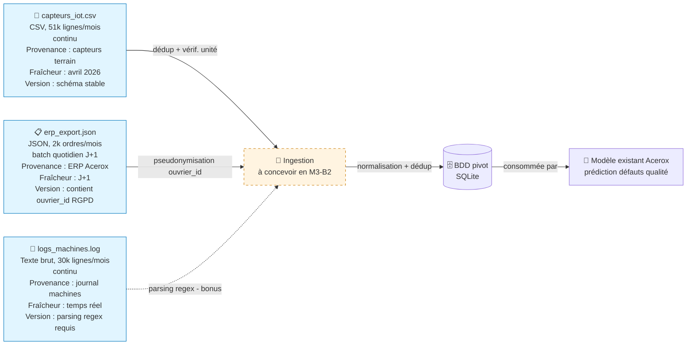

# Schéma des flux de données — Acerox Métallurgie

> Schéma Mermaid à compléter. Doit montrer :
> - **Sources** (capteurs IoT, ERP, logs, *bonus rapports `.md`*)
> - **Ingestion** (à concevoir en M3-B2)
> - **BDD pivot** (à modéliser en M3-B2)
> - **Modèle existant** Acerox (placeholder, hors-sujet ici)
>
> Légende explicite : qui produit, qui consomme, contraintes.

## Schéma

## Légende

> Reformule en 5 lignes max ce que le schéma raconte (qui produit quelle
> donnée, qui consomme, contraintes critiques).

- **Producteur** : capteurs terrain (3 sites), ERP Acerox (Roubaix + Saint-Étienne), journal machines — tous sur avril 2026.
- **Consommateur final** : le futur modèle prédictif de maintenance, via la BDD pivot (à concevoir en M3-B2).
- **Contraintes critiques** : `ouvrier_id` (ERP) à pseudonymiser (RGPD, identifiant direct) ; croiser logs/capteurs (ligne + horodatage) avec l'ERP permet de reconstituer indirectement l'opérateur en poste au moment d'une anomalie — à ne pas faire à la maille individuelle avant pseudonymisation (RGPD, réidentification indirecte) ; unité du capteur de température de Roubaix LINE-3 à vérifier avant tout calcul ; logs à parser (regex) ; aucune source ne porte le label "non-conformité", pourtant la cible du modèle.

## Décisions associées

- Source(s) retenues en priorité : `capteurs_iot.csv` et `logs_machines.log` (anomalies exploitables), `erp_export.json` en complément (contexte production).
- Source(s) écartées : `capteurs_site_A.csv` et `capteurs_site_B.csv` — échantillons non comparables (autre période, schéma incompatible, bug d'unité) : voir `M3-B1_fusion_provenance.ipynb`.
- Source bonus (rapports `.md`) traitée ? Non — aucun rapport `.md` fourni dans ce jeu de données.

---

*Schéma produit par Nawelle, 21/07/2026, dans le cadre du brief M3-B1 ATOS.*
